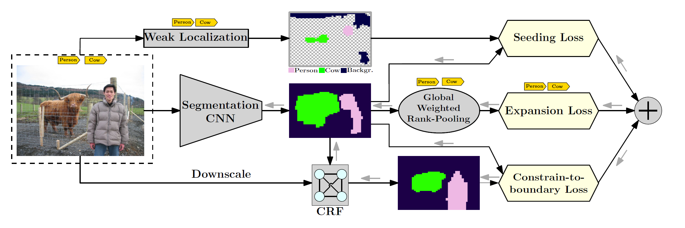
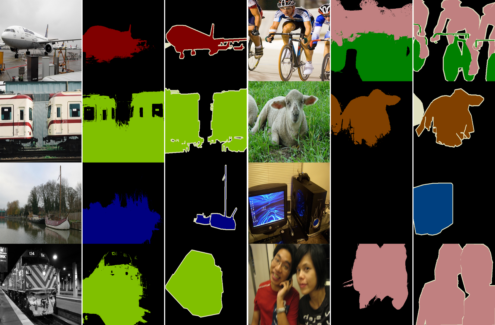

# Seed, Expand, Constrain: Three Principles for Weakly-Supervised Image Segmentation
PyTorch implementation of "Seed, Expand, Constrain: Three Principles for Weakly-Supervised Image Segmentation", ECCV2016

This is not the official repository for this paper. For the official, please see the following links.

- Paper : [https://arxiv.org/abs/1603.06098](https://arxiv.org/abs/1603.06098)

- Official code : [caffe implmentation](https://github.com/kolesman/SEC)

## Introduction
This is a work that proposes a new composite loss function for training convolutional neural network for the task of 
weakly-supervised semantic segmentation.
Three novel loss functions are introduced:
 - Seeding loss
 - Expasion loss
 - Contrain-to-boundary loss 




## Updates
11 Nov, 2019: Initial upload

## Prerequisites
- Python 3.6
- PyTorch >= 1.0.0
- Torchvision >= 0.2.2
- PIL
- opencv-python (OpenCV for Python)
- tqdm
- tensorboardX


#####Fully connected CRF wrapper (requires the Eigen3 Package)
```bash
apt-get install libeigen3-dev

# this should be done after download the source..
pip install CRF/
```


## Data & Model Preparation
Pascal VOC 2012 dataset (VOC2012) is used for this implementation.
- Download VOC2012 from [here](http://host.robots.ox.ac.uk/pascal/VOC/voc2012/VOCtrainval_11-May-2012.tar)
- You can see the detail of VOC2012 in [http://host.robots.ox.ac.uk/pascal/VOC/voc2012/index.html](http://host.robots.ox.ac.uk/pascal/VOC/voc2012/index.html)


We use ImageNet pretrained model which is coverted from Caffe.
- Download the pretrained model from [here](https://drive.google.com/a/yonsei.ac.kr/file/d/1Fs25jmy9uZJxLlWFfdOESOs5EXnAr0OK/view?usp=sharing)
- You can convert it on your own. Please see [here](https://github.com/marvis/pytorch-caffe) for more details.


## Execution

- download the source code & localization cue preparation
```bash
git clone https://github.com/halbielee/SEC_pytorch.git
cd SEC_pytorch 

# localizatio-cue preparation
gzip -kd datalist/PascalVOC/localization_cues.pickle.gz
```

- train
```bash
# Before executing this, please set the appropriate dataset path
bash script/train.sh
``` 

- test (generate the prediction map)
```bash
# Before executing this, please set the appropriate dataset path and other options..
bash script/test_multiprocess.sh
``` 

- evaluation (calculate the performance)
```bash
# Before executing this, please set the appropriate prediction_map / gt_map path
bash script/evaluation.sh
```


## Performance

We evaluate the PyTorch implementation with hyperparms which the author provided without any other tuning. 

| Method | Backbone  |  mIOU | Download                                                     |
| :----: | --------- | :---: | :----------------------------------------------------------: |
|    SEC | DeepLab-LargeFOV | 50.6049  | [:arrow_down:](https://drive.google.com/a/yonsei.ac.kr/file/d/1G9c4ZYi4OyZwpZQV8UVrHBRedHk5IA33/view?usp=sharing) |
|    SEC | DeepLab-LargeFOV | 49.6978  | [:arrow_down:](https://drive.google.com/a/yonsei.ac.kr/file/d/1tFPC7G-rpcCUQ_pcKWqycNbWoOePhwMj/view?usp=sharing) |


## Segmentation Result
Origin : Prediction : Ground Truth

{: widths="100%")